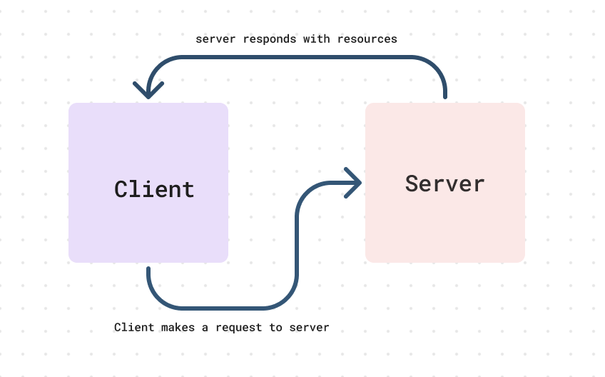

# Node Ecosystem, CI, CD

**Author**: **Wajiha Khan**

**Version**: **1.0.0**

**Overview**:

Todays objective focuses on automated testing and server deployment through continuous integration and continuous deployment. I built and deployed a web server to familiarize myself with the process.

**Key Components**:

1. Automated Testing: implementing code-driven testing for thorough code validation.
2. Web Server Creation: Constructing a robust web server infrastructure.
3. CI/CD Integration: Streamlining build, test and deployment processes for efficiency.

